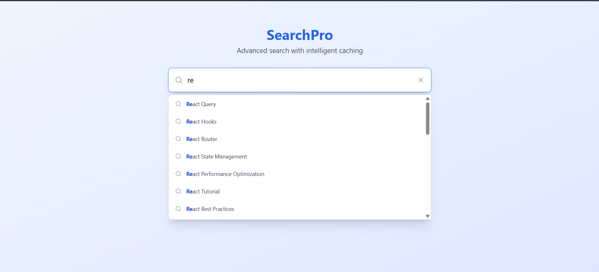

### 🚀 **Search Pro - Advanced search with intelligent caching**
---

## 📸 Preview

<p align="center">
  
</p>

---

## 🔗 Live Demo

🌍 [Live Deployment](https://recat-frontend-jz6jk6hml-mulinti-rohith-naidus-projects.vercel.app/)

---

## 🛠️ Tech Stack

Built with modern tools for speed and scalability:

- ⚡ [Vite](https://vitejs.dev/)
- 🟦 [TypeScript](https://www.typescriptlang.org/)
- ⚛️ [React](https://react.dev/)
- 🧩 [shadcn/ui](https://ui.shadcn.com/)
- 🎨 [Tailwind CSS](https://tailwindcss.com/)

---

## ✨ Features

- 🔍 **Autocomplete Input**
- ⏳ **Debounced Search** (300ms)
- 💡 **Highlight Matched Substrings**
- 🔁 **LRU Cache** (Last 10 queries cached)
- 🧪 **Dummy Data Based Filtering**
- ⚡ **Fast, Responsive UI**

---


# 🧑‍💻 How to Run Locally

You’ll need **Node.js** and **npm** installed. We recommend using [nvm](https://github.com/nvm-sh/nvm).

---

## 🖥️ Local Setup

# 1️⃣ Clone the repo
'git clone https://github.com/RohithNai537/Recat_Frontend.git`

# 2️⃣ Navigate into the project
# `cd React_Frontend`

# 3️⃣ Install dependencies
 # `npm install`

# 4️⃣ Start dev server
 # `npm run dev`


## ⚙️ Alternative: GitHub Codespaces

- Click the green **Code** button on GitHub  
- Select the **Codespaces** tab  
- Create a new Codespace  
- Start editing in-browser instantly 🧠  

---

## 📂 Editing in GitHub

### ✏️ Edit a File

1. Navigate to the file  
2. Click the 🖉 (pencil) icon at the top right  
3. Make your changes  
4. Add a commit message  
5. Click **Commit changes**  

---

## 🌍 Deployment Options

Deploy on your favorite platform:

- ▶️ Vercel  
- 🔁 Netlify  
- 🧳 Any static host supporting Vite + React  

---

## 🤩 What Makes It Special?

- ⚡ Smooth search experience with performance boost  
- 🧠 Visually intuitive interface  
- 💨 Tailwind-powered responsive design  
- 🛠️ Production-ready and cleanly structured  

---

## 📩 Feedback or Contributions

Feel free to fork, improve, and share your version.  
Contributions welcome! 🙌  

---

## 👨‍🎓 Author

**Name:** Mulinti Rohith Naidu 
**Email:** mulintirohan159@gmail.com
**Project:** Frontend -Autofill Input with LRU Cache & Debounce  

## 💾 Dummy Data Sample

```json
[
  { "id": 1, "name": "React Query" },
  { "id": 2, "name": "React Hooks" },
  ...
  { "id": 60, "name": "Tailwind CSS Interview Questions" }
]


